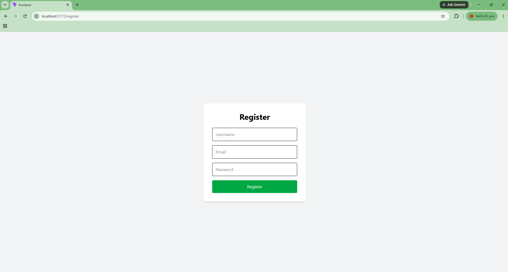
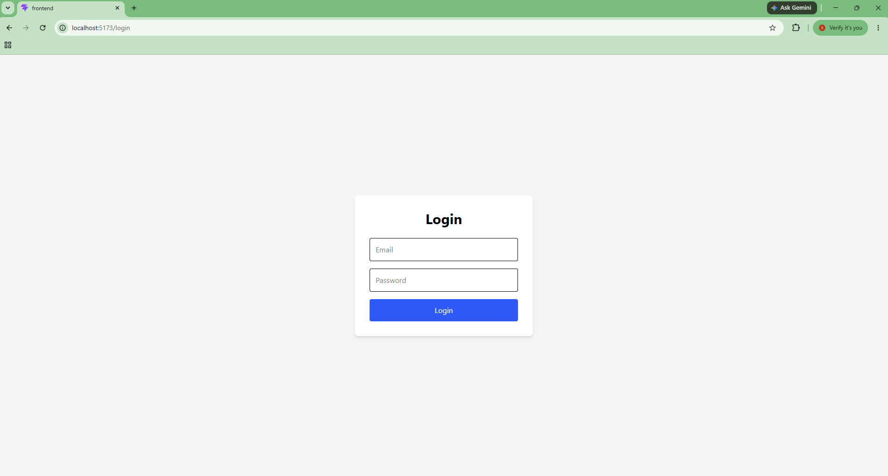
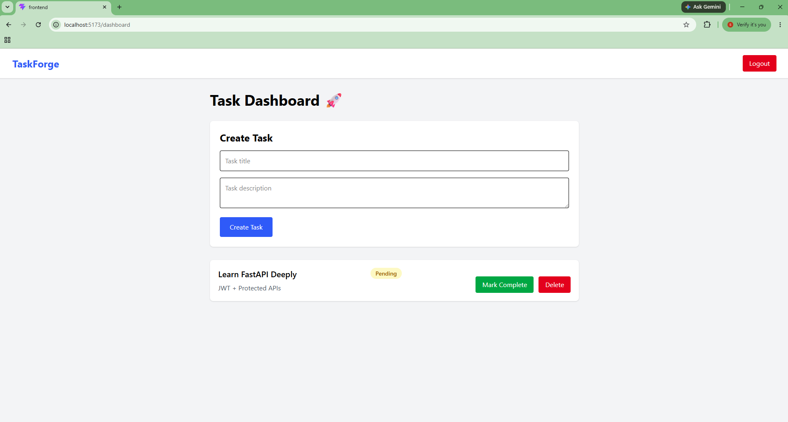

# TaskForge 🚀

TaskForge is a full-stack authentication-based task management application built using FastAPI, PostgreSQL, React, Tailwind CSS, and JWT Authentication.

The project demonstrates complete frontend-backend integration with secure authentication, protected routes, and user-specific task management.

---

# Features

## Authentication

* User Registration
* User Login
* JWT Authentication
* Protected Frontend Routes
* Protected Backend APIs

## Task Management

* Create Tasks
* View User-Specific Tasks
* Update Task Status
* Delete Tasks

## Frontend

* React + Vite
* Tailwind CSS
* React Router DOM
* Axios API Integration
* Context API Authentication
* Protected Routing
* Shared Layout Architecture

## Backend

* FastAPI
* PostgreSQL
* SQLAlchemy ORM
* Pydantic Validation
* JWT Authentication
* Password Hashing with bcrypt

---

# Tech Stack

## Frontend

* React
* Vite
* Tailwind CSS
* Axios
* React Router DOM

## Backend

* FastAPI
* PostgreSQL
* SQLAlchemy
* Passlib
* Python-JOSE

---

# Project Structure

## Frontend

frontend/src/
├── api/
├── components/
├── context/
├── layouts/
├── pages/
├── routes/
└── utils/

## Backend

backend/app/
├── auth/
├── db/
├── models/
├── routers/
├── schemas/
├── core/
└── main.py

---

## Screenshots

### Register Page

### Login Page

### Dashboard

---

### Swagger API Documentation

---

# Authentication Flow

User Login
↓
JWT Token Generated
↓
Frontend Stores Token
↓
Axios Interceptor Attaches Token
↓
Protected APIs Accessed Securely

---

# API Endpoints

## Authentication

* POST /register
* POST /login

## Tasks

* GET /tasks
* POST /tasks
* PUT /tasks/{id}
* DELETE /tasks/{id}

---

# Setup Instructions

## Backend Setup

cd backend

pip install -r requirements.txt

uvicorn app.main:app --reload

---

## Frontend Setup

cd frontend

npm install

npm run dev

---

# Database

PostgreSQL is used as the primary relational database.

---

# Concepts Learned

* JWT Authentication
* Protected Routes
* Frontend-Backend Integration
* React Context API
* Axios Interceptors
* FastAPI Architecture
* SQLAlchemy ORM
* CRUD Operations
* Authorization & Authentication

---

# Future Improvements

* Dockerization
* Refresh Token Authentication
* Task Categories
* Search & Filters
* Pagination
* Notifications
* CI/CD Pipeline
* Deployment

---

# Author

Sangeeta Achari
